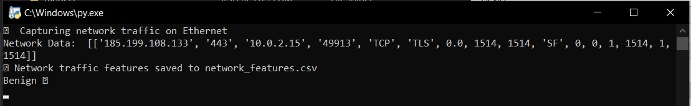
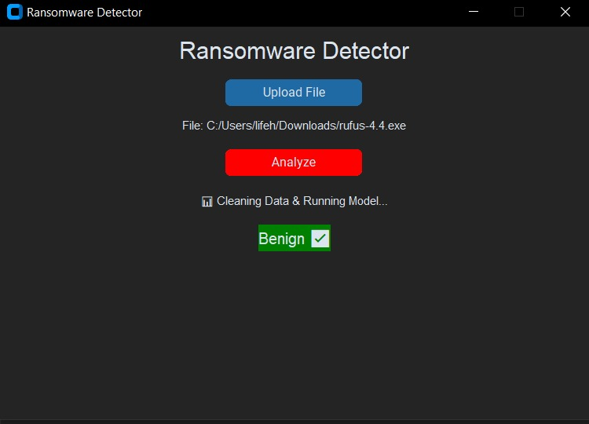

# 🛡️ Ransomware Detection App

This project is a Windows desktop application that detects ransomware based on **network traffic behavior**. It uses **machine learning (XGBoost)** to classify `.exe` files as **benign or malicious**, using network features captured during execution. It is lightweight, GUI-based, and ideal for research or educational purposes.

---

## 🧠 Features

- Detects malicious `.exe` files using network traffic data
- Built-in GUI using **Tkinter**
- Uses **Wireshark + PyShark** for live traffic capture
- **XGBoost model** trained on static network features
- Tested safely in a **VirtualBox Windows 10 environment**
- Based on academic research
- Lightweight and suitable for **IoT / Edge Devices**

---

## 🖥️ GUI Preview

### 🔹 Analysis in Progress  


### 🔹 Result Display  


---

## ⚙️ Setup Instructions

### 🔧 Pre-requisites

Before running the app, make sure you have:

- **Windows 10 VirtualBox**  
  To safely execute `.exe` files in isolation

- **Python 3**  
  Installed inside your VirtualBox environment

- **Wireshark**  
  With `tshark.exe` added to the system **PATH**

- **Python dependencies**  
  Install using:
  ```bash
  pip install -r requirements.txt


